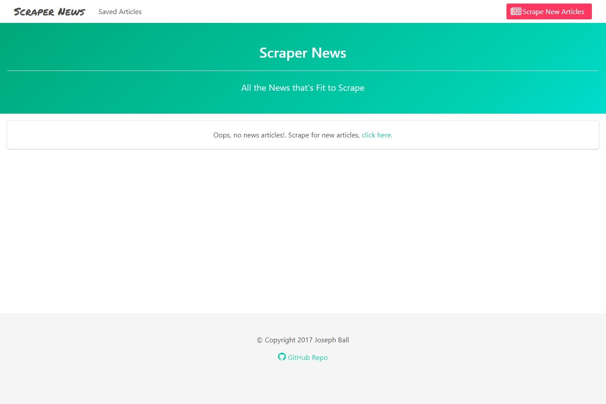

# News-Scraping
Scrape news articles and save them to a database.

## Overview
A web page that lets users scrape news articles from www.reddit.com/r/news/. They can then save and delete articles to a database. Also, the user can save notes to specific articles.

## On Load Screen

## Functionality
The front end is built with `HTML`, `CSS`, `Bulma`, and `Handlebars`. The back end is built with `Node`, `Express`, and `Mongoose`. Articles are scraped using `Cheerio` and `MongoDB` is the database that is used.

## Screenshots

### Page with Scraped Articles

### Page with Saved Articles

## Tech used

    "HTML": "5",
    "CSS": "3",
    "Bulma": "0.5.0",
    "JavaScript": "ECMA-262",
    "jQuery": "3.2.1",
    "Node": "6.11.0 LTS",
    "Express": "4.15.3",
    "Handlebars": "3.0.0",
    "Mongoose": "4.11.5",
    "MongoDB": "3.4.7",
    "Cheerio": "1.0.0-rc.2"

## Authors
*Rutgers Codding Bootcamp Project*
* **Joseph Ball** - [josephtball](https://github.com/josephtball)
